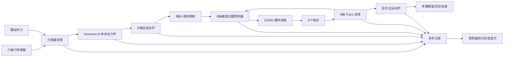

# CDPR E3000 8绳6自由度力交互速度闭环控制架构设计

## 1. 文档目的

本文档用于规划 `conti_ctrl` 从当前“单轴速度模式位置闭环测试程序”扩展为“8绳6自由度绳驱并联机器人力交互控制程序”的软件架构。

目标控制链路为：

1. 采集动平台六维力传感器输出，或使用软件模拟六维外力旋量；
2. 根据当前外力和上一时刻期望状态，采用 Newmark-β 法求得下一时刻动平台期望位姿、速度和加速度；
3. 通过逆运动学求得8根绳索的期望绳长、绳速和绳加速度；
4. 复用现有速度模式位置闭环思路，对8个电机分别执行“期望速度前馈＋位置误差反馈”；
5. 同帧采集8轴实际位置，将其换算为实际绳长；
6. 通过正运动学估算末端实际位姿，与期望位姿进行时间对齐后的误差比较；
7. 异步记录控制、反馈、动力学和安全诊断数据。

本方案采用 E3000 控制卡。当前源码中的 `E5000HardwareInterface`、`E5000ContiInterface` 等名称属于早期工程遗留命名，后续重构时应逐步改为不绑定具体卡型的名称，但不应在第一阶段仅为改名而扰动已验证的底层调用逻辑。

---

## 2. 总体结论

推荐采用“传感器采集、机器人控制、控制卡访问、正运动学估计、数据记录、UI显示”相互解耦的分层多线程架构。

最关键的原则是：

- 动力学只推进一个控制步，不预先生成整条轨迹；
- 控制逻辑线程不直接调用 LTDMC，不写文件，也不绘图；
- 控制卡线程独占全部 LTDMC 调用，并以一帧8轴命令为最小调度单位；
- 8轴命令必须使用同一个控制帧号和同一个期望末端状态生成；
- 正运动学不放入1 ms级内环，因为它是非线性迭代问题；
- 实际末端位姿第一阶段只用于监控和评估，不立即反向修正 Newmark 状态；
- 所有几何、零位、方向和单位换算必须集中管理，物理模型内部不出现板卡 unit；
- 速度位置控制不能保证绳索始终张紧，必须增加预紧状态和松绳风险监测。

推荐的数据流如下：



---

## 3. 现有代码可复用内容

### 3.1 `MATLAB代码/Newmark-β` 目录

当前 `rigid_body_newmark.m` 使用：

- 广义坐标：`q=[x,y,z,φ,θ,ψ]`；
- ZYX 欧拉角；
- 平动力在全局坐标系表达；
- 转动力矩在刚体坐标系表达；
- `β=0.25`、`γ=0.5` 的平均加速度 Newmark 方法；
- 固定点迭代求解下一时刻加速度。

现有 MATLAB 程序虽然按完整时间历程循环，但循环体本身可以直接抽取为有状态的单步接口：

```cpp
NewmarkStepResult NewmarkBetaStepper::step(
    const Wrench6d &externalWrench,
    double dtSeconds);
```

每次调用只根据状态 `x_d(k)`、`v_d(k)`、`a_d(k)` 和当前外力，求出 `k+1` 时刻的期望状态，符合“当前时刻才知道下一时刻期望轨迹”的需求。

这里的 ZOH 不是 Newmark-β 算法的一部分，而是对离散实时力输入的因果约定：在区间 `[t_k,t_{k+1})` 内使用当前已取得的力样本 `W_k`。不能在不增加一拍等待的情况下使用尚未采集到的 `W_{k+1}` 做无延迟 FOH。

### 3.2 `MATLAB代码/CDPR_dynamics_solve/G302_current`

G302 当前版本是后续 C++ 数学模块的主要参照，具体包括：

- `fun_cdpr_params_G302.m` 中的机架出绳点、平台连接点、质量、惯量、初始位姿和传感器安装参数；
- `transform_sensor_wrench_to_ee.m` 中六维力旋量从传感器坐标系变换到动平台参考点的关系；
- `G302.m` 中平台连接点全局坐标、绳索方向、绳长和雅可比的定义；
- `checkCableInterferenceFull.m` 与 `checkCableplatInterference.m` 中绳—绳和绳—平台圆柱简化模型的干涉检查；
- `bary_center.m`、`pseudo_inverse_new.m` 中满足上下限约束的张力分配思路。

G302 当前主程序使用四元数 RK4、离线完整时间历程和 `50 ms` 仿真步长，这三点不直接迁移到实时控制。未来状态推进统一采用纯惯性 Newmark-β 单步接口，正式控制周期以总线周期和实测整帧计算耗时确定。

### 3.3 原工程 `0523_final`

可以复用或重写为独立数学模块的内容包括：

- `CdprDynModel` 中质量、惯量、锚点、平台吊点、传感器坐标等参数组织方式；
- `calculateTotalExternalForce()` 中传感器力旋量坐标变换和力矩平移的思路；
- `PositionSimulationModel` 中“末端位姿→全局吊点→滑轮修正绳长”的逆运动学；
- `MatrixFun::cableLengthCalculate()` 中考虑滑轮几何的绳长计算；
- `ForceSimulationModel::solvePoseFromCableLengths()` 中通过绳长残差最小化求末端位姿的正运动学思路；
- 轴号、绳索号、初始绳长、电机零位、传动方向之间的映射逻辑。

不建议直接复用的部分包括：

- 将批量轨迹、仿真播放、UI更新和控制计算混在一起的线程逻辑；
- 正运动学中每次固定从 `[0,0,400,0,0,0]` 开始求解；
- 在实时控制路径中直接执行无最大迭代次数限制的非线性优化；
- 大量使用多层 `std::vector` 传递固定维数实时数据。

### 3.4 当前 `conti_ctrl`

当前单轴速度闭环已经具备以下基础：

- 速度模式启动时调用一次 `dmc_vmove`；
- 运行中每个控制周期调用 `dmc_change_speed_unit`；
- 期望速度前馈＋位置误差 PID 修正；
- 最大速度、最大加速度、在线变速时间和 PID 修正限幅；
- Trace type 3/4/5/6 的速度和位置反馈；
- Trace 延迟标定、延迟对齐误差和异步数据记录；
- 控制卡在线轴数检测、8轴使能状态显示和全总线轴一键使能/失能；
- 板卡脉冲当量已统一为左侧全局配置，测试页不再各自保存一份；
- 单轴点位运动、所选轴 Trace 反馈和 Trace 延迟标定已合并到“单轴调试与反馈”页；
- 数据记录入口已迁移到左侧全局状态区，不再保留独立的“数据记录与曲线”页；
- `ContiWorker` 运行在控制逻辑线程，`E5000HardwareInterface` 内部硬件线程独占 LTDMC；
- `TelemetryRecorder` 已有独立写盘线程；
- UI低频批量绘图。

后续扩展的核心不是复制8份单轴页面逻辑，而是把单轴控制器抽成可并行计算的8轴控制器，并由一个机器人控制协调器统一生成一帧8轴指令。

当前仍存在以下与8轴机器人控制直接相关的限制：

- `E5000HardwareInterface`、`E5000ContiInterface` 和窗口标题仍保留早期 E5000 命名，但当前实机已换回 E3000；第一阶段只增加适配层，不为改名扰动已验证调用；
- 控制卡可以检测到8个在线轴，不等于已经具备8轴同帧 Trace 控制反馈；
- `TraceTelemetryFrame` 及其帧转换目前仍只保存最多2个轴；
- 单轴测试运行时会按当前测试任务重新配置 Trace 对象，尚不存在机器人模式下固定的8轴反馈配置；
- 当前只有单个 `PositionVelocityPid` 实例和单轴状态，尚无8轴命令帧、公共缩放及命令所有权仲裁；
- 尚无 `RobotConfiguration`、Newmark C++单步器、CDPR正逆运动学和六维力源。

---

## 4. 坐标系、状态和单位

### 4.1 坐标系

统一定义：

- `{W}`：机器人全局坐标系；
- `{B}`：动平台刚体坐标系，原点建议取动平台动力学参考点或质心；
- `{S}`：六维力传感器坐标系；
- `A_i^W`：第 `i` 根绳索的机架锚点；
- `b_i^B`：第 `i` 根绳索在动平台上的局部吊点；
- `P_i^W = p^W + R_WB b_i^B`：当前末端位姿下的全局吊点。

力传感器读数必须先从 `{S}` 转到动力学参考点：

\[
F_W=R_{WS}F_S
\]

\[
M_W=R_{WS}M_S+r_{OS}^{W}\times F_W
\]

其中 `r_OS` 是动力学参考点到传感器测量点的位置矢量。坐标方向、安装姿态和力矩参考点一旦定义，必须写入配置文件并在UI中只读显示。

### 4.2 内部单位

数学与控制核心统一使用国际单位：

- 平移：m；
- 线速度：m/s；
- 线加速度：m/s²；
- 姿态：rad；
- 角速度：rad/s；
- 角加速度：rad/s²；
- 绳长：m；
- 绳速：m/s；
- 绳加速度：m/s²；
- 力：N；
- 力矩：N·m；
- 时间：s。

UI可以显示 mm、deg、N、N·m。电机输出轴角度可使用 deg。板卡 unit 只能出现在 `CableMotorMapper` 与硬件接口边界，不得进入 Newmark 和运动学核心。

### 4.3 固定维数状态结构

建议采用 Eigen 固定维数对象或 `std::array`：

```cpp
struct PlatformState {
    Eigen::Matrix<double, 6, 1> pose;
    Eigen::Matrix<double, 6, 1> velocity;
    Eigen::Matrix<double, 6, 1> acceleration;
    quint64 frameId = 0;
    quint64 timestampUs = 0;
};

struct CableState {
    Eigen::Matrix<double, 8, 1> length;
    Eigen::Matrix<double, 8, 1> velocity;
    Eigen::Matrix<double, 8, 1> acceleration;
};

struct AxisCommandFrame {
    std::array<double, 8> targetPositionDegree {};
    std::array<double, 8> feedforwardVelocityDegreePerSecond {};
    std::array<double, 8> commandVelocityDegreePerSecond {};
    quint8 validAxisMask = 0;
    quint64 frameId = 0;
    quint64 deadlineUs = 0;
};
```

### 4.4 `RobotConfiguration` 参数模型

CDPR几何、物理参数、被模拟刚体参数、传感器安装关系和8轴映射必须统一由 `RobotConfiguration` 管理。控制算法不得直接读取UI控件，也不得在多个类中各保存一套锚点、方向或零位。

建议结构为：

```cpp
struct RobotConfiguration {
    QString schemaVersion;
    QString configurationId;

    CoordinateFrameConfig frames;
    CdprGeometryConfig geometry;
    std::array<CableAxisConfig, 8> cables;

    PhysicalPlatformConfig physicalPlatform;
    VirtualRigidBodyConfig virtualBody;
    ForceSensorConfig forceSensor;

    MultiAxisControlConfig control;
    WorkspaceLimitConfig workspace;
    RobotSafetyConfig safety;
    HardwareTimingConfig hardware;
};
```

各部分职责如下。

#### 4.4.1 坐标系和CDPR几何

`CoordinateFrameConfig` 与 `CdprGeometryConfig` 至少包含：

- 世界坐标系 `{W}` 的轴向约定；
- 动平台坐标系 `{B}` 的原点和轴向约定；
- 传感器坐标系 `{S}` 相对 `{B}` 的平移和旋转；
- 8个出绳点全局坐标 `anchorPointWorldM[8]`，即 \(A_i^W\)；
- 8个动平台连接点局部坐标 `platformPointBodyM[8]`，即 \(b_i^B\)；
- 各滑轮中心、半径、轴向和出绳几何模型；
- CDPR初始末端位姿及其姿态约定；
- 几何版本号和标定日期。

所有点坐标在配置文件中统一使用米，姿态统一使用弧度或旋转矩阵。若UI采用mm和deg，必须在配置装载边界一次转换，禁止在运动学内部混用。

#### 4.4.2 绳索、卷筒和轴映射

每个 `CableAxisConfig` 至少包含：

```cpp
struct CableAxisConfig {
    int cableId = -1;
    int cardAxis = -1;
    int motorDirection = 0;          // 只能为 +1 或 -1

    double initialCableLengthM = 0.0;
    double softwareZeroDegree = 0.0;
    double fixedDrumRadiusM = 0.0;
    DrumModelType drumModel = DrumModelType::FixedRadius;

    double minimumCableLengthM = 0.0;
    double maximumCableLengthM = 0.0;
    double maximumCableSpeedMps = 0.0;
    double maximumCableAccelerationMps2 = 0.0;

    double minimumAxisPositionDegree = 0.0;
    double maximumAxisPositionDegree = 0.0;
    double maximumAxisSpeedDegreePerSecond = 0.0;
    double maximumAxisAccelerationDegreePerSecond2 = 0.0;
};
```

脉冲当量是当前程序左侧栏中的全局板卡配置，由硬件配置单独管理；机器人配置保存本次运行所要求的 `degreesPerCardUnit`，启动时必须与控制卡实际读回状态一致，但不能在每根绳索中重复设置。

#### 4.4.3 真实动平台与被模拟刚体

必须明确区分两套质量参数：

- `PhysicalPlatformConfig`：真实动平台、六维力传感器、工装和负载的质量、质心与惯量，用于重力补偿、力矩参考点变换、预紧和安全评估；
- `VirtualRigidBodyConfig`：Newmark纯惯性模型中的等效质量、等效质心与等效惯量，决定外力作用下的期望自由漂浮响应。

两套参数可以在某个试验中取相同数值，但软件结构中不得合并。真实平台参数变化不应暗中改变被模拟目标的动力学；虚拟质量变化也不应破坏传感器重力补偿。

`VirtualRigidBodyConfig` 还应包含：

- `beta=0.25`、`gamma=0.5`；
- 初始位姿、线速度、角速度和加速度；
- 固定点迭代次数上限与收敛阈值；
- 是否采用欧拉角连续化；
- 姿态奇异性阈值。

纯惯性模型不包含回中刚度、虚拟阻尼或人为衰减参数。

#### 4.4.4 六维力传感器

`ForceSensorConfig` 至少包含：

- 设备型号、序列号、通讯方式和标称采样率；
- 原始通道到 `Fx/Fy/Fz/Mx/My/Mz` 的映射和符号；
- 单位比例；
- 传感器坐标系相对平台坐标系的位姿；
- 测量点到动力学参考点的力臂；
- 零偏、温漂补偿参数和标定时间；
- 重力补偿所使用的传感器、工装及负载质量参数；
- 合法量程、跳变阈值、超时阈值、死区和低通截止频率。

原始值、零偏补偿值、坐标变换后值和最终送入Newmark的力旋量必须分别可记录。

### 4.5 JSON配置文件建议

建议配置文件使用带版本号的JSON，示意结构如下：

```json
{
  "schemaVersion": "1.0",
  "configurationId": "cdpr_lab_8cable_v1",
  "frames": {
    "worldAxisConvention": "X-right,Y-forward,Z-up",
    "platformPoseConvention": "position+ZYX",
    "sensorToPlatform": {
      "translationM": [0.0, 0.0, 0.0],
      "rotationMatrix": [[1,0,0],[0,1,0],[0,0,1]]
    }
  },
  "geometry": {
    "anchorPointWorldM": [[0,0,0],[0,0,0],[0,0,0],[0,0,0],
                           [0,0,0],[0,0,0],[0,0,0],[0,0,0]],
    "platformPointBodyM": [[0,0,0],[0,0,0],[0,0,0],[0,0,0],
                            [0,0,0],[0,0,0],[0,0,0],[0,0,0]],
    "initialPose": [0,0,0,0,0,0]
  },
  "physicalPlatform": {
    "massKg": 0.0,
    "centerOfMassBodyM": [0,0,0],
    "inertiaBodyKgM2": [[0,0,0],[0,0,0],[0,0,0]]
  },
  "virtualBody": {
    "massKg": 1.0,
    "centerOfMassBodyM": [0,0,0],
    "inertiaBodyKgM2": [[1,0,0],[0,1,0],[0,0,1]],
    "initialVelocity": [0,0,0,0,0,0],
    "beta": 0.25,
    "gamma": 0.5,
    "maximumIterations": 4,
    "convergenceTolerance": 1e-8
  },
  "cables": [
    {
      "cableId": 0,
      "cardAxis": 0,
      "motorDirection": 1,
      "initialCableLengthM": 0.0,
      "softwareZeroDegree": 0.0,
      "drumModel": "fixedRadius",
      "fixedDrumRadiusM": 0.0
    }
  ],
  "hardware": {
    "cardNo": 0,
    "expectedAxisCount": 8,
    "degreesPerCardUnit": 1.0,
    "busCycleUs": 1000,
    "traceSamplePeriodUs": 1000,
    "controlPeriodUs": 5000
  }
}
```

JSON中的零值只是待标定占位值，不能通过正式运行校验。8根绳索必须保存8个完整条目，示例中只展开第1项以控制篇幅。

### 4.6 配置装载和校验规则

配置加载后必须先生成结构化校验报告，不允许“尽量运行”。至少检查：

1. `schemaVersion` 是否受支持，必需字段是否完整；
2. 所有数值是否有限，数组维数是否严格为6、8或3×3；
3. 8个 `cableId` 和 `cardAxis` 是否分别唯一且覆盖预期集合；
4. `motorDirection` 是否只能为 `+1/-1`；
5. 出绳点、平台连接点是否存在重复或明显退化布局；
6. 旋转矩阵是否正交且行列式接近1；
7. 真实质量、虚拟质量、卷筒半径和各限值是否为有效正数；
8. 真实惯量和虚拟惯量是否对称正定，并满足基本刚体惯量关系；
9. 绳长、轴位置、速度、加速度上下限是否有序；
10. 初始位姿逆运动学得到的8绳长度是否与配置初始绳长在容差内一致；
11. 初始绳长正运动学是否收敛并回到配置初始位姿；
12. `degreesPerCardUnit` 是否与控制卡初始化所用全局值一致；
13. 总线周期、Trace周期和控制周期是否满足整数倍关系及实时预算；
14. 传感器坐标变换、量程、超时和零偏信息是否有效；
15. 工作空间是否包含初始位姿，且安全边界留有余量。

配置只允许在机器人状态为“未配置”或“已停止”时装载。进入“准备完成”后应生成不可变运行快照，并把配置ID、文件哈希、装载时间和校验报告写入本次记录元数据。运行中不得通过UI直接修改锚点、方向、零位、质量、惯量或安全边界。

---

## 5. 期望动力学：Newmark-β 单步状态推进

### 5.1 控制含义

六维力传感器不是直接给出位置指令，而是作为单刚体动力学正解的外部输入。目标是模拟太空微重力环境中的自由漂浮刚体，因此期望动力学采用纯惯性模型，不加入回中刚度、虚拟阻尼或人为衰减项：

\[
m\ddot p_W=F_W
\]

\[
I_B\dot\omega_B+\omega_B\times I_B\omega_B=M_B
\]

其中：

- `m`、`I_B`：被模拟刚体的等效质量和体坐标系惯量；
- `F_W`：全局坐标系下的外力；
- `M_B`：体坐标系下、绕质心的外力矩。

这意味着外力撤去后加速度回到0，但刚体保持已有速度和角速度继续漂浮，不会自动减速或回到初始位置。这是目标物理现象，不应被控制算法当作漂移消除。

传感器零偏会被纯惯性积分持续累积，因此必须依靠静态标定、温漂补偿、有效外力判定和安全边界处理，而不能通过回中刚度或阻尼掩盖。安全限速、工作空间限制和停机减速属于机器人执行层保护，不写入被模拟刚体的动力学方程。

### 5.2 单步算法

每个控制周期执行一次：

1. 读取上一时刻 `q_k`、`q̇_k`、`q̈_k`；
2. 根据当前力旋量计算动力学右端；
3. 计算 Newmark 预测量；
4. 固定点迭代下一时刻加速度；
5. 得到 `q_(k+1)`、`q̇_(k+1)`、`q̈_(k+1)`；
6. 检查收敛性、工作空间和速度/加速度限制；
7. 只有结果有效时才提交为新的期望状态。

实时实现必须设置严格的迭代上限，例如2～4次，并记录：

- 实际迭代次数；
- 最终残差；
- 是否收敛；
- 单步计算耗时。

平动质量和体坐标惯量为常量时应预计算可复用项；非线性转动耦合仍按现有刚体欧拉方程计算，并对 Newmark 校正过程设置有界迭代。

### 5.3 姿态表示

第一版可继续使用现有 ZYX 欧拉角，以便与原工程运动学保持一致，但必须增加：

- `|cos(pitch)|` 奇异性阈值；
- 姿态工作范围；
- 欧拉角连续化，避免跨越 `±π` 时跳变；
- 角速度与欧拉角速度的明确转换。

长期版本建议内部使用四元数或旋转矩阵推进姿态，仅在UI和兼容接口中转换为 ZYX 欧拉角。

---

## 6. 逆运动学与8轴参考生成

### 6.1 位姿到绳长

对第 `i` 根绳索：

\[
P_i^W=p^W+R_{WB}b_i^B
\]

第一版遵循 G302 当前使用的直线绳段模型：

\[
c_i=A_i^W-P_i^W,\qquad l_i=\|c_i\|
\]

这套模型应先移植为无UI、无全局变量的固定维数纯数学函数，并与 G302 数值结果逐项对照。原工程的滑轮修正绳长模型只作为后续扩展；只有实物滑轮中心、半径、轴向和切点定义确认后，才允许替换直线绳段模型。

### 6.2 绳速和绳加速度

沿用 G302 的几何定义，令 `u_i=c_i/l_i`，`r_i=R_{WB}b_i^B`，并定义：

\[
J_i=
\begin{bmatrix}
u_i^T & (r_i\times u_i)^T
\end{bmatrix}
\]

由于本项目规定“绳长增加为正”，G302 这一定义对应：

\[
\dot L=-J
\begin{bmatrix}
v\\
\omega
\end{bmatrix}
\]

因此程序中的绳长雅可比应显式定义为 `J_L=-J`，再计算：

\[
\dot L=J_L(q)\dot q,\qquad
\ddot L=J_L(q)\ddot q+\dot J_L(q,\dot q)\dot q
\]

若滑轮修正模型的解析雅可比暂时难以一次完成，第一阶段可采用与实际控制周期一致的几何差分：

\[
\dot l_{k+1}=\frac{l_{k+1}-l_k}{\Delta t}
\]

\[
\ddot l_{k+1}=\frac{\dot l_{k+1}-\dot l_k}{\Delta t}
\]

但必须使用同一时间戳、固定步长和低噪声的期望量，不能用主机定时器实际抖动时间随意差分。解析雅可比完成后，绳速前馈应切换为解析值，差分结果保留为诊断对照。

### 6.3 绳长到电机角度

每根绳索都需要独立标定：

```text
绳索号
→ 控制卡轴号
→ 电机正方向
→ 初始实际绳长
→ 初始电机输出轴角度
→ 卷筒有效半径/层数模型
→ 输出轴角度
→ 板卡 unit
```

固定半径卷筒可先使用：

\[
\Delta\theta_i=s_i\frac{\Delta l_i}{r_i}
\]

其中 `s_i∈{-1,+1}` 为方向符号。若绳索在卷筒上分层，必须使用随层数变化的有效半径模型，否则运动范围增大后，绳长误差会呈系统性累积。

原工程中的 `(homeCableLen - cableLen) * cableMotorCof` 可以作为映射参考，但应重写为带单位、方向和有效性检查的 `CableMotorMapper`，禁止散落在UI或控制线程中。

### 6.4 张力可行性与干涉检查

张力分配在速度闭环方案中用于验证当前位姿是否具备合理承载能力，不直接代替绳长/绳速命令。第一阶段沿用 G302 约定：

- 运行期张力可行区间暂定为 `10–500 N`；
- `10 N` 是防止松绳的最低允许张力，不是运行期额外施加的预紧目标；
- 预紧只在机器人启动前建立；
- 运行期张力分配只承担真实动平台及其固定载荷的重力，目标力矩为零；纯惯性虚拟刚体不引入重力、刚度或阻尼；
- 干涉检查覆盖全部 `C(8,2)=28` 对绳索，并使用 G302 的平台圆柱简化模型检查绳—平台干涉。

若张力分配无可行解或干涉裕量低于阈值，应拒绝该期望帧或触发保护，禁止仅向部分轴下发命令。

---

## 7. 8轴速度模式位置闭环

### 7.1 单轴控制律

第 `i` 轴使用：

\[
e_i=\theta_{d,i}-\theta_{a,i}
\]

\[
v_{cmd,i}=v_{ff,i}
+K_{p,i}e_i
+K_{i,i}\int e_i\,dt
+K_{d,i}(v_{d,i}-v_{a,i})
\]

其中：

- `θ_d`：由期望绳长映射得到的电机期望位置；
- `θ_a`：由同一帧 Trace 实际位置得到的电机实际位置；
- `v_ff`：由期望绳速映射得到的速度前馈；
- `v_a`：Trace 实际速度，或由实际位置经时间对齐和滤波后估计。

复用当前 `PositionVelocityPid` 的限幅和抗积分饱和逻辑，但需要由单个实例扩展为：

```cpp
std::array<PositionVelocityPid, 8> axisControllers;
```

### 7.2 8轴协调限幅

不能只对超限轴单独截断而让其余轴保持原速度，否则会破坏末端协同运动。推荐分两级处理：

1. 各轴 PID 修正项独立限幅；
2. 合成8轴速度后，若任一轴超过速度或加速度限制，则计算公共缩放系数 `0<λ≤1`，按同一 `λ` 缩放8轴合成命令。

公共缩放必须记录并显示。当缩放长期小于1时，说明当前被模拟刚体参数、外力输入或机构状态产生了超出电机能力的期望运动。此时应检查等效质量/惯量、外力范围和执行机构限值，而不是持续依赖饱和运行。

### 7.3 板卡调用

启动阶段：

- 8轴完成使能、Trace有效、零位有效和安全检查；
- 每轴调用一次 `dmc_vmove`；
- 初始速度从0按统一斜坡进入首帧命令。

运行阶段：

- 每个机器人控制周期生成一帧8轴目标速度；
- 硬件线程在同一批处理中顺序调用8次 `dmc_change_speed_unit`；
- 记录批次开始时间、每轴API耗时、总耗时和最慢轴；
- 禁止UI线程、记录线程或动力学线程直接调用LTDMC。

8次API调用并不是真正的硬件同时写入，因此必须实测“第1轴到第8轴”的下发时间跨度。若总耗时接近或超过控制周期，不能强行使用1 ms控制周期，应先使用5 ms或10 ms完成闭环验证，再依据99.9%分位耗时逐步缩短周期。

### 7.4 命令过期处理

机器人控制不是轨迹队列回放，不允许积压旧命令。建议硬件线程只保留最新一帧：

- 新帧覆盖尚未执行的旧帧，并增加 `overwrittenCommandCount`；
- 命令超过截止时间则丢弃；
- 连续1个周期无新命令可暂时保持上一速度；
- 连续超过配置时间无新命令，统一斜坡降为0；
- 再超过安全超时，执行立即停止并失能。

---

## 8. 反馈采集与正运动学

### 8.1 8轴同帧反馈

控制所需的最低反馈是同一 Trace 帧内的8轴实际位置。不能在8个不同主机时刻逐轴读取后拼成一帧，否则运动时会引入虚假的机构位姿误差。

当前代码的真实能力边界是：

1. 控制卡初始化可以检测并显示0～8个在线轴，也可对全部在线轴一键使能/失能；
2. `E5000HardwareInterface::configureTrace()` 已能按传入轴列表配置每轴 type 3/4/5/6，并在内部以动态轴列表解析采样值；
3. 但对外高频帧 `TraceTelemetryFrame` 仍是长度为2的固定数组；
4. `E5000HardwareInterface` 生成 `TraceTelemetryFrame` 时明确使用 `min(2, traceAxes.size())`，因此记录、延迟标定和速度闭环消费链路最多得到2轴；
5. 当前各单轴测试任务会根据所选轴重新配置 Trace；“单轴调试与反馈”页只显示当前所选轴，Trace延迟标定也已合并到该页；
6. 独立的标定实时曲线已删除，但 type 3/4/5/6 原始帧自动记录、在线拟合和离线复核仍保留。

所以，“检测到8个EtherCAT轴”只说明总线拓扑和基础轴配置可见，不能据此宣称程序已经完成8轴同帧反馈。

因此，进入8轴开发前必须先完成控制卡能力试验：

- 确认 E3000 能否同一采样配置8个 type 6 实际位置对象；
- 确认最大Trace对象数、单帧字节数、缓存深度和1 ms采样稳定性；
- 确认8轴同帧是否丢帧；
- 测量批量取帧耗时。

建议按优先级配置：

1. 必需：8轴 type 6 实际位置；
2. 次优先：8轴 type 4 实际速度；
3. 诊断：type 5 指令位置、type 3 指令速度。

机器人模式不应默认照搬单轴的4对象/轴配置。若同时配置 type 3/4/5/6，8轴共需32个对象；只有实测证明对象数、单帧字节数和读取耗时均有裕量时才能启用。

若卡侧不能稳定容纳32个对象，实时控制不得通过轮换Trace对象来拼接8轴反馈。应建立固定的“机器人运行Trace配置”：

- 始终保留8轴 type 6 实际位置；
- 若容量允许，再保留8轴 type 4 实际速度；
- 上位机已知的8轴命令速度直接随命令帧记录；
- type 3和type 5只在专项诊断配置中启用，不作为机器人运行的必需对象。

软件实现不建议直接扩大旧的两轴测试结构后让所有页面共享，而应新增语义明确的机器人反馈帧：

```cpp
struct AxisFeedbackFrame8 {
    std::array<double, 8> actualPositionDegree {};
    std::array<double, 8> actualVelocityDegreePerSecond {};
    std::array<quint16, 8> axisState {};
    std::array<quint16, 8> axisError {};
    quint8 validPositionMask = 0;
    quint8 validVelocityMask = 0;
    quint64 traceSequence = 0;
    quint64 traceTimeUs = 0;
};
```

旧 `TraceTelemetryFrame` 暂时服务于已验证的单轴/两轴测试；机器人模式通过新帧类型完成8轴能力试验，稳定后再决定是否统一底层结构。

### 8.2 实际绳长

8轴实际位置必须经过与期望路径完全相同的零位、方向和卷筒模型换算：

\[
\theta_{actual}\rightarrow l_{actual}
\]

不能直接把“电机角度变化”当作“绳长变化”，也不能在期望侧考虑滑轮/卷筒而在实际侧使用另一套简化换算。

### 8.3 正运动学

8根绳长对6自由度位姿构成超定非线性问题，推荐求解：

\[
\min_q \sum_{i=1}^{8} w_i
\left(l_i(q)-l_{i,actual}\right)^2
+w_c\|q-q_{prev}\|^2
\]

其中：

- 上一时刻位姿 `q_prev` 作为初值和连续性先验；
- 工作空间边界作为约束；
- 异常绳长可降低权重而不是直接污染全部位姿；
- 输出残差RMS、最大单绳残差、迭代次数和是否收敛。

原工程的 `kine()` 每次固定从同一个初值开始，并且最大迭代次数为0所代表的默认行为不适合直接进入实时控制。新实现应：

- 使用上一帧结果热启动；
- 设置最大迭代次数和时间预算；
- 运行在独立的正运动学线程；
- 第一阶段以50～200 Hz运行；
- 控制内环不等待正运动学结果。

实际末端速度、加速度不能直接对带噪位姿做一阶、二阶裸差分，应使用带宽受控的微分器、α-β滤波器或状态观测器。

### 8.4 末端误差

至少区分三种误差：

- 轴位置控制误差：`θ_d - θ_a`；
- 绳长误差：`l_d - l_a`；
- 末端位姿误差：`x_d(t_aligned) - x_a(t)`。

姿态误差不建议长期直接使用欧拉角逐项相减，应使用旋转矩阵或四元数计算最小旋转误差，再转换为三维小角度误差用于显示。

Trace延迟标定结果可继续用于诊断误差的时间对齐。8轴情况下应使用统一帧序号，并保留每轴标定延迟。若各轴延迟不同，诊断可以逐轴对齐；正运动学输入必须来自同一实际帧，不能为了逐轴延迟补偿而破坏8根绳长的同步性。

当前单轴页面已经区分“轨迹时间误差”和“延迟对齐误差”，Trace延迟标定结果会保存并用于速度闭环诊断。机器人模式应延续这种区分：

- 控制器的轴位置误差采用对应控制帧的期望轴位置与最新有效实际位置；
- 性能评估使用时间戳和已标定延迟，把期望历史值对齐到实际反馈时刻；
- 末端正运动学始终使用同一 Trace 帧的8根实际绳长；
- 末端期望/实际误差在正运动学输出后按时间戳对齐，不在正运动学输入前逐轴移动样本。

静态偏置属于测量链路或零位诊断量，不应自动从机器人轴位置控制误差中永久扣除。若确认偏置来源于零位，应通过重新标定软件零位修正，而不是把偏置藏在误差公式中。

---

## 9. 线程和职责划分

当前程序不是“UI线程直接控制板卡”：

- `MainWindow` 创建独立的 `ContiWorker` 控制逻辑线程；
- `E5000HardwareInterface` 内部再维护唯一硬件线程和硬件后端；
- LTDMC调用通过阻塞或排队方式进入硬件线程执行；
- `TelemetryRecorder` 内部已有独立写盘线程；
- UI以约20 Hz更新状态和测试曲线。

机器人框架必须复用这一硬件访问边界，不能再创建第二个能够直接调用LTDMC的“机器人硬件线程”。新增的是机器人控制协调线程、传感器线程和正运动学线程；机器人命令最终仍通过现有硬件接口提交。待机器人链路稳定后，才将遗留 `E5000*` 类名重命名为卡型无关名称。

### 9.1 推荐线程

| 线程 | 主要职责 | 禁止事项 |
|---|---|---|
| UI线程 | 参数编辑、按钮、20 Hz左右状态与曲线刷新 | 不调用LTDMC、不做动力学/正运动学、不写高频数据 |
| 传感器线程 | 采集六维力、时间戳、零偏和基础滤波 | 不生成电机命令 |
| 机器人控制线程 | Newmark单步、逆运动学、8轴控制律和安全判定 | 不调用LTDMC、不写文件、不重绘 |
| 现有硬件线程 | 独占E3000/LTDMC、Trace取帧、8轴命令批处理、停机 | 不做Newmark/正运动学、不输出高频UI日志 |
| 正运动学线程 | 根据8绳实际长度估计末端实际位姿 | 不阻塞控制线程 |
| 现有/扩展记录线程 | 批量写入二进制、事件日志，离线导出CSV | 不反向阻塞生产者 |

### 9.2 线程间数据交换

建议使用固定容量的单生产者/单消费者环形缓冲，或受控的“最新快照”：

- `SensorFrameBuffer`：传感器线程→控制线程；
- `AxisFeedbackBuffer`：硬件线程→控制线程/正运动学线程；
- `AxisCommandSlot`：控制线程→硬件线程，只保留最新帧；
- `PlatformEstimateBuffer`：正运动学线程→UI/记录线程；
- `TelemetryRingBuffer`：各实时线程→记录线程。

机器人命令使用“只保留最新帧”的槽位，而不是普通FIFO。正运动学可以使用有界队列，但队列落后时应丢弃旧反馈并从最新完整帧继续，不能反向拖慢控制线程。

还必须新增运动任务所有权仲裁：

- `None`：无任务；
- `SingleAxisJog`：单轴点位；
- `VelocityTest`：单轴速度闭环；
- `TorqueTest`：单轴转矩；
- `TraceCalibration`：Trace延迟标定；
- `RobotForceInteraction`：8轴力交互。

任一时刻只能有一个所有者下发运动命令。进入机器人“准备”状态后即禁止其他测试页启动；机器人退出并确认8轴静止后才释放所有权。

禁止在周期线程中：

- 等待UI互斥锁；
- 等待磁盘；
- 追加无界 `QVector`；
- 逐周期发送带长文本的日志信号；
- 使用阻塞队列积压历史命令。

周期诊断只更新结构化计数器，文本日志由低频状态线程按事件或固定间隔生成。

---

## 10. 一个控制周期的完整时序

设机器人控制周期为 `T_c`，第 `k` 个周期执行：

1. 硬件线程取得最新完整8轴Trace帧 `Feedback(k)`；
2. 传感器线程发布最新力旋量帧 `Wrench(k)`；
3. 控制线程检查两帧的时间戳、帧号和新鲜度；
4. 对传感器读数执行零偏、重力、坐标和参考点变换；
5. `NewmarkBetaStepper` 根据 `Wrench(k)` 推进得到 `PlatformDesired(k+1)`；
6. 检查期望位姿是否位于安全工作空间，检查速度、加速度和欧拉角奇异性；
7. 逆运动学得到 `CableDesired(k+1)`；
8. `CableMotorMapper` 生成8轴期望位置和速度前馈；
9. 8个位置速度控制器使用 `Feedback(k)` 计算 `AxisCommand(k+1)`；
10. 执行8轴公共速度/加速度缩放和最终安全限幅；
11. 把带截止时间的整帧命令提交给硬件线程；
12. 硬件线程顺序下发8个 `dmc_change_speed_unit`；
13. 实际绳长帧异步送往正运动学线程；
14. 全部结构化数据异步送往记录线程。

注意：`PlatformDesired(k+1)` 是从上一期望状态积分得到的命令状态。第一阶段不要每周期用实际正运动学结果覆盖它，否则会把测量噪声和正运动学迭代误差直接注入动力学积分。实际位姿只在启动时初始化 Newmark 状态，并在运行中用于监控。后续如需纠偏，应单独设计低带宽、有限幅的外环观测校正。

---

## 11. 控制周期与实时性预算

当前系统总线周期可以设为1 ms，但这不等于上位机8轴控制计算和8次API调用必然能稳定在1 ms内完成。

建议第一阶段采用以下方法确定控制周期：

1. 单独测量8轴Trace取帧耗时分布；
2. 测量Newmark单步、逆运动学和8轴PID耗时；
3. 测量连续8次 `dmc_change_speed_unit` 的总耗时和轴间跨度；
4. 连续运行至少30分钟，统计平均值、99%、99.9%和最大值；
5. 选择能够保留至少30%裕量的控制周期。

推荐先以5 ms或10 ms完成8轴软件闭环和安全验证，再尝试2 ms、1 ms。控制周期不是越小越好；周期抖动、命令过期和批次跨周期比适度增大固定周期更危险。

所有控制算法使用帧时间戳计算有效 `dt`，但安全限幅应同时限制 `dt` 的允许范围。若出现异常长周期，不能按异常 `dt` 一次积分出大位移，应拒绝该步并进入降速或停机。

---

## 12. 六维力输入模块

### 12.1 统一接口

建议定义：

```cpp
class IWrenchSource {
public:
    virtual ~IWrenchSource() = default;
    virtual bool latest(WrenchFrame &frame) = 0;
};
```

实现：

- `SimulatedWrenchSource`：UI输入恒力、阶跃、脉冲、正弦或脚本化力旋量；
- `ForceTorqueSensorSource`：真实传感器采集；
- 后续可增加 `RecordedWrenchReplaySource` 用于离线复现实验。

控制线程不关心力来自UI还是真实传感器，切换输入源不改变Newmark、运动学和电机控制代码。

### 12.2 真实传感器处理顺序

建议顺序为：

1. 原始量转换为N和N·m；
2. 传感器零偏；
3. 坐标轴符号和安装姿态变换；
4. 测量点到动平台参考点的力矩平移；
5. 工装、传感器自身和悬挂物重力补偿；
6. 死区与限幅；
7. 低延迟低通滤波；
8. 新鲜度和异常跳变检测。

滤波器必须记录原始值和滤波值。不能用重滤波掩盖机械振动，否则会增加交互延迟。

---

## 13. 安全逻辑

### 13.1 启动前条件

全部满足后才允许进入8轴速度模式：

- 控制卡初始化成功且检测到8个预期轴；
- 8轴状态机、错误码和使能状态正常；
- 轴号—绳索号映射完整且无重复；
- 8轴脉冲当量、方向和软件零位有效；
- 初始8绳长度与已知初始位姿的逆运动学结果一致；
- 初始正运动学收敛且残差低于阈值；
- 六维力传感器已清零，或已明确选择模拟输入；
- Newmark参数、工作空间和轴限幅有效；
- 8轴同帧反馈已连续稳定若干帧；
- 动平台处于已建立预紧力的安全状态。

### 13.2 运行中保护

必须监测：

- 力传感器超时、丢包和突变；
- Trace超时、丢帧和8轴不同步；
- 控制命令超时和控制周期超限；
- 任一轴报警、失能或API失败；
- 单轴位置误差、速度和加速度超限；
- 期望/实际绳长范围；
- 期望末端位姿、速度和加速度范围；
- Newmark不收敛或姿态接近奇异；
- 正运动学不收敛或残差过大；
- 公共缩放系数长期过小；
- 任一绳索张力低于 `10 N` 防松绳下限或高于暂定 `500 N` 上限；
- 张力分配无可行解；
- 任意绳—绳或绳—平台干涉裕量不足。

CDPR只能通过绳索拉力工作。只控制绳长而不监测绳力，无法保证所有绳索始终张紧。如果当前硬件没有8路绳力传感器，第一阶段至少应：

- 限制末端运动范围和加速度；
- 启动前完成机械预紧，运行期监测张力不低于防松绳下限，不额外施加“运行期预紧指令”；
- 监控异常绳长变化和电机负载；
- 在低速、小范围、有人监护条件下测试。

### 13.3 停机等级

- 正常停止：退出自由漂浮仿真状态，由执行层接管并将8轴命令统一斜坡降为0；仅将外力置0不会使纯惯性模型自行停止；
- 保护停止：立即冻结Newmark积分，8轴按安全减速度降为0；
- 紧急停止：控制卡立即停止，随后失能；
- 通讯失联：硬件线程不依赖UI，独立执行超时停机。

### 13.4 机器人状态机

建议状态如下：

```text
Unconfigured
  → Configured
  → HardwareReady
  → PretensionReady
  → Ready
  → Running
  → Stopping
  → Stopped

任意可运行状态
  → ProtectiveStop
  → Fault
  → EmergencyStop
```

| 当前状态 | 允许进入条件 | 允许操作 |
|---|---|---|
| `Unconfigured` | 程序启动或配置已卸载 | 加载配置 |
| `Configured` | JSON校验通过 | 初始化控制卡、执行静态数学检查 |
| `HardwareReady` | 8轴在线、Trace稳定、零位有效 | 建立/确认预紧 |
| `PretensionReady` | 预紧条件满足 | 初始化Newmark和正运动学 |
| `Ready` | 全部启动前检查通过 | 启动力交互 |
| `Running` | 已取得运动任务所有权 | 周期控制、正常停止、急停 |
| `Stopping` | 已冻结Newmark，8轴正在统一降速 | 等待静止 |
| `Stopped` | 8轴静止且命令清零 | 重新准备、卸载配置 |
| `ProtectiveStop` | 可恢复保护触发 | 查明原因、复位后重新准备 |
| `Fault` | 轴报警、API失败或不可恢复计算错误 | 安全停机、人工复位 |
| `EmergencyStop` | 急停或通讯看门狗触发 | 只允许安全关闭和人工复位 |

任何状态转换都必须产生结构化事件，包含原状态、目标状态、触发原因、帧号和时间戳。UI按钮只请求状态转换，不直接使能轴或下发速度。

---

## 14. UI设计建议

当前界面采用左、中、右三栏：

- 左侧为全局控制卡状态、总线周期、全局脉冲当量、8轴使能状态、全局记录和急停；
- 中间为连续插补、单轴调试与反馈、速度闭环、转矩测试和扩展预留页；
- 右侧为全部页面共用的运行日志。

“数据记录与曲线”独立页已经删除；开始/停止记录位于左侧全局区。“Trace延迟标定”独立页也已经删除，其参数、控制和数值结果已合并到“单轴调试与反馈”页，标定实时曲线不再显示。

后续将“扩展功能（预留）”替换为独立的“8轴力交互控制”页，不与单轴测试参数混合，也不在新页重复放置全局脉冲当量、控制卡初始化、全局记录或急停控件。

### 14.1 运行区

- 输入源：模拟外力 / 六维力传感器；
- 机器人状态：未准备、准备完成、运行、保护停止、急停；
- 准备、启动、正常停止、急停；
- 当前控制周期、最大抖动、8轴API批次耗时；
- 当前公共速度缩放系数。

### 14.2 参数区

主页面只保留常用参数：

- 被模拟刚体的等效质量/惯量；
- 初始位姿、初始线速度和初始角速度；
- 末端速度和加速度上限；
- 8轴控制器参数模板；
- 模拟六维力输入。

真实动平台质量、锚点、平台连接点、滑轮、卷筒、轴映射、零位、传感器安装位姿等放入“机器人配置”对话框或独立配置页，并支持：

- 从JSON加载；
- 保存为新配置；
- 显示配置ID、文件哈希和校验状态；
- 分组显示几何、真实平台、虚拟刚体、传感器、绳索轴映射和安全边界；
- 运行期间只读；
- 校验失败时禁止进入准备状态，并可定位到具体字段。

### 14.3 状态与曲线

建议显示：

- 六维外力：原始、补偿后、滤波后；
- 末端6维期望/实际状态；
- 8绳期望/实际绳长和误差；
- 8轴命令/实际速度；
- 8轴控制误差和允许范围；
- Newmark残差、正运动学残差；
- 控制周期、Trace丢帧、命令覆盖和API耗时。

绘图继续使用“高频存点、低频批量显示”。默认UI刷新20 Hz，曲线可按屏幕像素抽稀，不得把全部1 ms样本逐点触发重绘。

---

## 15. 建议类和目录

```text
conti_ctrl/
├─ robot/
│  ├─ RobotControlCoordinator
│  ├─ RobotControlTypes
│  ├─ RobotSafetySupervisor
│  ├─ RobotControlStateMachine
│  ├─ RobotConfiguration
│  ├─ RobotConfigurationValidator
│  └─ MotionTaskArbiter
├─ dynamics/
│  ├─ NewmarkBetaStepper
│  └─ WrenchProcessor
├─ kinematics/
│  ├─ CdprKinematics
│  ├─ CableGeometry
│  ├─ CableMotorMapper
│  └─ ForwardKinematicsEstimator
├─ sensor/
│  ├─ IWrenchSource
│  ├─ SimulatedWrenchSource
│  └─ ForceTorqueSensorSource
├─ control/
│  ├─ PositionVelocityPid
│  └─ MultiAxisVelocityController
├─ hardware/
│  ├─ RobotHardwareAdapter
│  ├─ E5000HardwareInterface       （现有遗留类名，内部实际连接E3000）
│  └─ RuntimeTraceSlaveReader
└─ telemetry/
   ├─ RobotTelemetryRecorder
   └─ RobotTelemetryTypes
```

第一阶段无需立即移动所有现有文件。可以先新增这些模块，通过 `RobotHardwareAdapter` 调用现有 `E5000HardwareInterface`，待8轴链路稳定后再做底层类名和窗口标题清理。

纯数学类不继承 `QObject`，不依赖UI和LTDMC，以便独立单元测试。只有协调器、线程适配器和UI桥接层使用Qt信号槽。

文档早期建议中的 `AdmittanceDynamics` 名称不再采用，避免暗示弹簧—阻尼导纳模型。目标动力学是无回中刚度、无虚拟阻尼的自由漂浮刚体，统一由 `NewmarkBetaStepper` 表达。

### 15.1 第一版接口骨架

第一版先稳定接口，不要求每个算法立即完整实现：

```cpp
class NewmarkBetaStepper {
public:
    ValidationResult configure(const VirtualRigidBodyConfig &config);
    void reset(const PlatformState &initialState);
    NewmarkStepResult step(const WrenchFrame &wrench, double dtSeconds);
};

class CdprKinematics {
public:
    ValidationResult configure(const CdprGeometryConfig &config);
    CableState inverse(const PlatformState &platform) const;
    ForwardKinematicsResult forward(
        const std::array<double, 8> &cableLengthM,
        const PlatformState &initialGuess) const;
};

class CableMotorMapper {
public:
    ValidationResult configure(
        const std::array<CableAxisConfig, 8> &cables);
    AxisReferenceFrame toAxisReference(
        const CableState &desiredCable) const;
    std::array<double, 8> toCableLength(
        const AxisFeedbackFrame8 &feedback) const;
};

class MultiAxisVelocityController {
public:
    void configure(const MultiAxisControlConfig &config);
    void reset(const AxisFeedbackFrame8 &initialFeedback);
    AxisCommandFrame update(
        const AxisReferenceFrame &reference,
        const AxisFeedbackFrame8 &feedback,
        double dtSeconds);
};

class RobotHardwareAdapter {
public:
    HardwareCapabilityResult probeCapabilities();
    bool configureRobotTrace(const RobotTraceConfig &config);
    bool startVelocityMode(const AxisCommandFrame &initialFrame);
    CommandDispatchResult submitLatest(const AxisCommandFrame &frame);
    bool requestStop(StopLevel level);
};
```

`RobotControlCoordinator` 是唯一编排者，负责：

1. 取得最新有效的力帧和8轴反馈帧；
2. 按状态机检查新鲜度和运行许可；
3. 调用Newmark、逆运动学、映射和8轴控制器；
4. 执行公共缩放与安全检查；
5. 提交最新命令帧；
6. 发布结构化状态和遥测。

各占位实现必须显式返回 `NotImplemented` 或 `SimulationOnly`，不得返回看似有效的全零结果后允许实机运行。

---

## 16. 分阶段实施

### 阶段0：代码骨架与配置

- 新增固定维数的机器人帧类型；
- 建立 `RobotConfiguration`、JSON装载和结构化校验；
- 建立机器人状态机和运动任务所有权仲裁；
- 建立模拟力源、模拟硬件适配器和空算法接口；
- 让“模拟力→占位动力学→占位运动学→8轴命令→模拟反馈→记录/UI”在不连接控制卡时完整运行；
- 为每个模块预留耗时、有效性、错误码和帧号诊断；
- 不在此阶段修改现有单轴测试底层调用。

### 阶段A：数学模块离线验证

- 将 MATLAB Newmark 单步算法移植为C++；
- 使用同一初值、同一外力和同一步长，与 MATLAB 逐步对比；
- 误差至少覆盖位姿、速度、加速度和迭代残差；
- 抽取逆运动学，完成位姿→8绳长测试；
- 抽取正运动学，完成“位姿→绳长→位姿”回环测试；
- 为坐标系、单位和轴映射建立自动测试。

### 阶段B：纯软件8轴仿真

- 使用模拟外力；
- 每周期Newmark产点；
- 生成8绳期望状态和8轴速度命令；
- 用简化电机模型产生虚拟实际位置；
- 检查同步限幅、命令超时和停机逻辑；
- 完成全链路记录与曲线。

### 阶段C：硬件能力与单轴验证

- 新增 `AxisFeedbackFrame8`，但保留旧两轴测试帧以避免回归；
- 测量8轴Trace对象容量和同帧能力，明确机器人运行Trace对象清单；
- 测量8次速度修改API的批次耗时；
- 选择实际可用控制周期；
- 仅连接1个轴，使用机器人命令链路中的一个绳索通道运行；
- 验证零位、方向、前馈和位置修正。

### 阶段D：2轴及8轴空载验证

- 扩展到2轴，检查同帧和批次时序；
- 扩展到8轴空载；
- 使用统一斜坡、公共缩放和停机；
- 人为制造Trace超时、命令超时和单轴报警，验证保护。

### 阶段E：8绳机构小范围验证

- 建立预紧；
- 从极小模拟外力和低虚拟速度开始；
- 验证逆运动学方向和绳长变化；
- 启用正运动学监测，但不闭合末端外环；
- 比较期望/实际末端位姿和8绳误差。

### 阶段F：真实六维力传感器

- 完成静态零偏、安装方向和重力补偿；
- 先记录不控制，验证六维力方向；
- 再以较大等效质量/惯量、较小模拟外力和低执行层速度上限启动；
- 逐步核对等效质量/惯量与外力响应；
- 最后评估是否需要低带宽末端位姿外环。

---

## 17. 验收指标

每一阶段都应形成可量化结果：

- Newmark C++与MATLAB逐步最大误差；
- 逆运动学/正运动学回环位姿误差；
- 8轴Trace同帧完整率和丢帧率；
- 控制周期平均、99.9%和最大抖动；
- 8轴API批次总耗时及首末轴下发跨度；
- 8轴最大位置误差和RMS误差；
- 8绳最大绳长误差和RMS误差；
- 末端平移/姿态最大误差和RMS误差；
- 正运动学残差、收敛率和耗时；
- 命令覆盖、过期、传感器超时和保护触发次数；
- 停止命令发出到8轴实际静止的时间。

---

## 18. 需要用户后续确认或标定的参数

G302 参数已作为首版 JSON 的来源，但“已写入配置”不等于“已经过实物确认”。以下信息必须在进入实机准备状态前完成复核或标定：

1. 核对 G302 中8个机架出绳点 `A_i`、8个平台连接点 `b_i` 与实物编号、单位和坐标方向；
2. 核对世界、平台、传感器坐标系以及传感器到动平台参考点的安装变换；
3. 分别确认真实动平台及固定载荷的质量、质心、惯量，以及被模拟自由漂浮刚体的等效质量、质心、惯量；
4. 确认是否启用滑轮修正；若启用，补齐8组滑轮中心、半径、轴向和实际切点几何；
5. 确认六维力传感器型号、通讯方式、采样率和硬件时间戳能力；
6. 标定8个轴与8根绳索的映射、收放绳方向、初始绳长、电机零位和卷筒有效半径；
7. 确认卷筒有效半径是否随缠绕层数变化；
8. 标定机构工作空间、绳长范围、轴位置/速度/加速度安全限值，以及平台圆柱模型尺寸和干涉安全距离；
9. 通过样机验证运行期 `10–500 N` 张力可行区间、松绳检测手段和启动前预紧流程；
10. 根据8轴 `dmc_change_speed_unit` 实测批次耗时确定正式控制周期；
11. 确认 E3000 可同时配置的 Trace 对象数量、单帧字节数和稳定采样周期。

真实动平台参数与被模拟刚体参数必须分别确认、分别保存，不能用同一组“质量参数”字段代替。

---

## 19. 推荐的第一轮代码工作

在正式连接8轴电机之前，推荐按以下顺序开发：

1. 建立 `robot/` 目录、固定维数帧类型、机器人状态机和运动任务所有权仲裁；
2. 实现 `RobotConfiguration`、JSON装载、校验报告和不可变运行快照；
3. 建立模拟力源、模拟硬件和各数学模块的占位接口，先跑通无实机骨架；
4. 把 MATLAB Newmark 算法移植为可单步调用的纯C++模块并做对照测试；
5. 按 G302_current 移植无UI依赖的直线绳段逆运动学、雅可比、张力可行性与干涉检查；正运动学仍参考原工程并以同一套 G302 几何参数重写；
6. 实现统一的8绳—8轴—零位—方向—卷筒映射；
7. 将单轴 PID 扩展为8轴控制器并增加公共缩放；
8. 通过 `RobotHardwareAdapter` 为现有硬件线程增加“整帧8轴速度命令”入口；
9. 新增独立的 `AxisFeedbackFrame8` 并完成卡侧Trace容量试验，不直接破坏旧两轴测试帧；
10. 新增异步正运动学线程和机器人遥测；
11. 替换UI中的“扩展功能（预留）”页；
12. 最后接入真实六维力传感器。

该顺序可以把动力学、运动学、实时调度和硬件能力逐层验证，避免在8绳实机上同时排查坐标、单位、控制周期和控制器参数。
