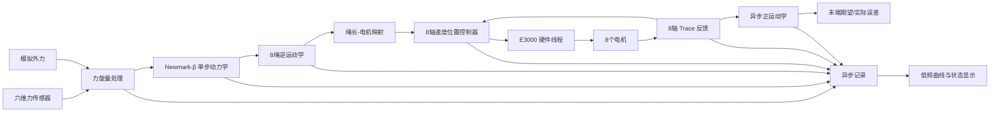

# CDPR E3000 8绳6自由度力交互速度闭环控制架构设计

## 1. 文档目的

本文档用于规划 `conti_ctrl` 从当前“单轴速度模式位置闭环测试程序”扩展为“8绳6自由度绳驱并联机器人力交互控制程序”的软件架构。

目标控制链路为：

1. 采集动平台六维力传感器输出，或使用软件模拟六维外力旋量；
2. 根据当前外力和上一时刻期望状态，采用 Newmark-β 法求得下一时刻动平台期望位姿、速度和加速度；
3. 通过逆运动学求得8根绳索的期望绳长、绳速和绳加速度；
4. 复用现有速度模式位置闭环思路，对8个电机分别执行“期望速度前馈＋位置误差反馈”；
5. 同帧采集8轴实际位置，将其换算为实际绳长；
6. 通过正运动学估算末端实际位姿，与期望位姿进行时间对齐后的误差比较；
7. 异步记录控制、反馈、动力学和安全诊断数据。

本方案采用 E3000 控制卡。当前源码中的 `E5000HardwareInterface`、`E5000ContiInterface` 等名称属于早期工程遗留命名，后续重构时应逐步改为不绑定具体卡型的名称，但不应在第一阶段仅为改名而扰动已验证的底层调用逻辑。

---

## 2. 总体结论

推荐采用“传感器采集、机器人控制、控制卡访问、正运动学估计、数据记录、UI显示”相互解耦的分层多线程架构。

最关键的原则是：

- 动力学只推进一个控制步，不预先生成整条轨迹；
- 控制逻辑线程不直接调用 LTDMC，不写文件，也不绘图；
- 控制卡线程独占全部 LTDMC 调用，并以一帧8轴命令为最小调度单位；
- 8轴命令必须使用同一个控制帧号和同一个期望末端状态生成；
- 正运动学不放入1 ms级内环，因为它是非线性迭代问题；
- 实际末端位姿第一阶段只用于监控和评估，不立即反向修正 Newmark 状态；
- 所有几何、零位、方向和单位换算必须集中管理，物理模型内部不出现板卡 unit；
- 速度位置控制不能保证绳索始终张紧，必须增加预紧状态和松绳风险监测。

推荐的数据流如下：



---

## 3. 现有代码可复用内容

### 3.1 `Newmark-β` 目录

当前 `rigid_body_newmark.m` 使用：

- 广义坐标：`q=[x,y,z,φ,θ,ψ]`；
- ZYX 欧拉角；
- 平动力在全局坐标系表达；
- 转动力矩在刚体坐标系表达；
- `β=0.25`、`γ=0.5` 的平均加速度 Newmark 方法；
- 固定点迭代求解下一时刻加速度。

现有 MATLAB 程序虽然按完整时间历程循环，但循环体本身可以直接抽取为有状态的单步接口：

```cpp
NewmarkStepResult NewmarkBetaStepper::step(
    const Wrench6d &externalWrench,
    double dtSeconds);
```

每次调用只根据状态 `x_d(k)`、`v_d(k)`、`a_d(k)` 和当前外力，求出 `k+1` 时刻的期望状态，符合“当前时刻才知道下一时刻期望轨迹”的需求。

### 3.2 原工程 `0523_final`

可以复用或重写为独立数学模块的内容包括：

- `CdprDynModel` 中质量、惯量、锚点、平台吊点、传感器坐标等参数组织方式；
- `calculateTotalExternalForce()` 中传感器力旋量坐标变换和力矩平移的思路；
- `PositionSimulationModel` 中“末端位姿→全局吊点→滑轮修正绳长”的逆运动学；
- `MatrixFun::cableLengthCalculate()` 中考虑滑轮几何的绳长计算；
- `ForceSimulationModel::solvePoseFromCableLengths()` 中通过绳长残差最小化求末端位姿的正运动学思路；
- 轴号、绳索号、初始绳长、电机零位、传动方向之间的映射逻辑。

不建议直接复用的部分包括：

- 将批量轨迹、仿真播放、UI更新和控制计算混在一起的线程逻辑；
- 正运动学中每次固定从 `[0,0,400,0,0,0]` 开始求解；
- 在实时控制路径中直接执行无最大迭代次数限制的非线性优化；
- 大量使用多层 `std::vector` 传递固定维数实时数据。

### 3.3 当前 `conti_ctrl`

当前单轴速度闭环已经具备以下基础：

- 速度模式启动时调用一次 `dmc_vmove`；
- 运行中每个控制周期调用 `dmc_change_speed_unit`；
- 期望速度前馈＋位置误差 PID 修正；
- 最大速度、最大加速度、在线变速时间和 PID 修正限幅；
- Trace type 3/4/5/6 的速度和位置反馈；
- Trace 延迟标定、延迟对齐误差和异步数据记录；
- LTDMC 调用由硬件线程独占；
- UI低频批量绘图。

后续扩展的核心不是复制8份单轴页面逻辑，而是把单轴控制器抽成可并行计算的8轴控制器，并由一个机器人控制协调器统一生成一帧8轴指令。

---

## 4. 坐标系、状态和单位

### 4.1 坐标系

统一定义：

- `{W}`：机器人全局坐标系；
- `{B}`：动平台刚体坐标系，原点建议取动平台动力学参考点或质心；
- `{S}`：六维力传感器坐标系；
- `A_i^W`：第 `i` 根绳索的机架锚点；
- `b_i^B`：第 `i` 根绳索在动平台上的局部吊点；
- `P_i^W = p^W + R_WB b_i^B`：当前末端位姿下的全局吊点。

力传感器读数必须先从 `{S}` 转到动力学参考点：

\[
F_W=R_{WS}F_S
\]

\[
M_W=R_{WS}M_S+r_{OS}^{W}\times F_W
\]

其中 `r_OS` 是动力学参考点到传感器测量点的位置矢量。坐标方向、安装姿态和力矩参考点一旦定义，必须写入配置文件并在UI中只读显示。

### 4.2 内部单位

数学与控制核心统一使用国际单位：

- 平移：m；
- 线速度：m/s；
- 线加速度：m/s²；
- 姿态：rad；
- 角速度：rad/s；
- 角加速度：rad/s²；
- 绳长：m；
- 绳速：m/s；
- 绳加速度：m/s²；
- 力：N；
- 力矩：N·m；
- 时间：s。

UI可以显示 mm、deg、N、N·m。电机输出轴角度可使用 deg。板卡 unit 只能出现在 `CableMotorMapper` 与硬件接口边界，不得进入 Newmark 和运动学核心。

### 4.3 固定维数状态结构

建议采用 Eigen 固定维数对象或 `std::array`：

```cpp
struct PlatformState {
    Eigen::Matrix<double, 6, 1> pose;
    Eigen::Matrix<double, 6, 1> velocity;
    Eigen::Matrix<double, 6, 1> acceleration;
    quint64 frameId = 0;
    quint64 timestampUs = 0;
};

struct CableState {
    Eigen::Matrix<double, 8, 1> length;
    Eigen::Matrix<double, 8, 1> velocity;
    Eigen::Matrix<double, 8, 1> acceleration;
};

struct AxisCommandFrame {
    std::array<double, 8> targetPositionDegree {};
    std::array<double, 8> feedforwardVelocityDegreePerSecond {};
    std::array<double, 8> commandVelocityDegreePerSecond {};
    quint64 frameId = 0;
    quint64 deadlineUs = 0;
};
```

---

## 5. 期望动力学：Newmark-β 单步状态推进

### 5.1 控制含义

六维力传感器不是直接给出位置指令，而是作为单刚体动力学正解的外部输入。目标是模拟太空微重力环境中的自由漂浮刚体，因此期望动力学采用纯惯性模型，不加入回中刚度、虚拟阻尼或人为衰减项：

\[
m\ddot p_W=F_W
\]

\[
I_B\dot\omega_B+\omega_B\times I_B\omega_B=M_B
\]

其中：

- `m`、`I_B`：被模拟刚体的等效质量和体坐标系惯量；
- `F_W`：全局坐标系下的外力；
- `M_B`：体坐标系下、绕质心的外力矩。

这意味着外力撤去后加速度回到0，但刚体保持已有速度和角速度继续漂浮，不会自动减速或回到初始位置。这是目标物理现象，不应被控制算法当作漂移消除。

传感器零偏会被纯惯性积分持续累积，因此必须依靠静态标定、温漂补偿、有效外力判定和安全边界处理，而不能通过回中刚度或阻尼掩盖。安全限速、工作空间限制和停机减速属于机器人执行层保护，不写入被模拟刚体的动力学方程。

### 5.2 单步算法

每个控制周期执行一次：

1. 读取上一时刻 `q_k`、`q̇_k`、`q̈_k`；
2. 根据当前力旋量计算动力学右端；
3. 计算 Newmark 预测量；
4. 固定点迭代下一时刻加速度；
5. 得到 `q_(k+1)`、`q̇_(k+1)`、`q̈_(k+1)`；
6. 检查收敛性、工作空间和速度/加速度限制；
7. 只有结果有效时才提交为新的期望状态。

实时实现必须设置严格的迭代上限，例如2～4次，并记录：

- 实际迭代次数；
- 最终残差；
- 是否收敛；
- 单步计算耗时。

平动质量和体坐标惯量为常量时应预计算可复用项；非线性转动耦合仍按现有刚体欧拉方程计算，并对 Newmark 校正过程设置有界迭代。

### 5.3 姿态表示

第一版可继续使用现有 ZYX 欧拉角，以便与原工程运动学保持一致，但必须增加：

- `|cos(pitch)|` 奇异性阈值；
- 姿态工作范围；
- 欧拉角连续化，避免跨越 `±π` 时跳变；
- 角速度与欧拉角速度的明确转换。

长期版本建议内部使用四元数或旋转矩阵推进姿态，仅在UI和兼容接口中转换为 ZYX 欧拉角。

---

## 6. 逆运动学与8轴参考生成

### 6.1 位姿到绳长

对第 `i` 根绳索：

\[
P_i^W=p^W+R_{WB}b_i^B
\]

然后使用原工程的滑轮几何模型计算：

\[
l_i=f_{pulley}(P_i^W,A_i^W,r_i)
\]

第一版应将 `MatrixFun::cableLengthCalculate()` 抽取为无UI、无全局变量、无动态配置修改的纯数学函数。

### 6.2 绳速和绳加速度

推荐优先使用解析雅可比：

\[
\dot l=J_l(q)\dot q
\]

\[
\ddot l=J_l(q)\ddot q+\dot J_l(q,\dot q)\dot q
\]

若滑轮修正模型的解析雅可比暂时难以一次完成，第一阶段可采用与实际控制周期一致的几何差分：

\[
\dot l_{k+1}=\frac{l_{k+1}-l_k}{\Delta t}
\]

\[
\ddot l_{k+1}=\frac{\dot l_{k+1}-\dot l_k}{\Delta t}
\]

但必须使用同一时间戳、固定步长和低噪声的期望量，不能用主机定时器实际抖动时间随意差分。解析雅可比完成后，绳速前馈应切换为解析值，差分结果保留为诊断对照。

### 6.3 绳长到电机角度

每根绳索都需要独立标定：

```text
绳索号
→ 控制卡轴号
→ 电机正方向
→ 初始实际绳长
→ 初始电机输出轴角度
→ 卷筒有效半径/层数模型
→ 输出轴角度
→ 板卡 unit
```

固定半径卷筒可先使用：

\[
\Delta\theta_i=s_i\frac{\Delta l_i}{r_i}
\]

其中 `s_i∈{-1,+1}` 为方向符号。若绳索在卷筒上分层，必须使用随层数变化的有效半径模型，否则运动范围增大后，绳长误差会呈系统性累积。

原工程中的 `(homeCableLen - cableLen) * cableMotorCof` 可以作为映射参考，但应重写为带单位、方向和有效性检查的 `CableMotorMapper`，禁止散落在UI或控制线程中。

---

## 7. 8轴速度模式位置闭环

### 7.1 单轴控制律

第 `i` 轴使用：

\[
e_i=\theta_{d,i}-\theta_{a,i}
\]

\[
v_{cmd,i}=v_{ff,i}
+K_{p,i}e_i
+K_{i,i}\int e_i\,dt
+K_{d,i}(v_{d,i}-v_{a,i})
\]

其中：

- `θ_d`：由期望绳长映射得到的电机期望位置；
- `θ_a`：由同一帧 Trace 实际位置得到的电机实际位置；
- `v_ff`：由期望绳速映射得到的速度前馈；
- `v_a`：Trace 实际速度，或由实际位置经时间对齐和滤波后估计。

复用当前 `PositionVelocityPid` 的限幅和抗积分饱和逻辑，但需要由单个实例扩展为：

```cpp
std::array<PositionVelocityPid, 8> axisControllers;
```

### 7.2 8轴协调限幅

不能只对超限轴单独截断而让其余轴保持原速度，否则会破坏末端协同运动。推荐分两级处理：

1. 各轴 PID 修正项独立限幅；
2. 合成8轴速度后，若任一轴超过速度或加速度限制，则计算公共缩放系数 `0<λ≤1`，按同一 `λ` 缩放8轴合成命令。

公共缩放必须记录并显示。当缩放长期小于1时，说明当前被模拟刚体参数、外力输入或机构状态产生了超出电机能力的期望运动。此时应检查等效质量/惯量、外力范围和执行机构限值，而不是持续依赖饱和运行。

### 7.3 板卡调用

启动阶段：

- 8轴完成使能、Trace有效、零位有效和安全检查；
- 每轴调用一次 `dmc_vmove`；
- 初始速度从0按统一斜坡进入首帧命令。

运行阶段：

- 每个机器人控制周期生成一帧8轴目标速度；
- 硬件线程在同一批处理中顺序调用8次 `dmc_change_speed_unit`；
- 记录批次开始时间、每轴API耗时、总耗时和最慢轴；
- 禁止UI线程、记录线程或动力学线程直接调用LTDMC。

8次API调用并不是真正的硬件同时写入，因此必须实测“第1轴到第8轴”的下发时间跨度。若总耗时接近或超过控制周期，不能强行使用1 ms控制周期，应先使用5 ms或10 ms完成闭环验证，再依据99.9%分位耗时逐步缩短周期。

### 7.4 命令过期处理

机器人控制不是轨迹队列回放，不允许积压旧命令。建议硬件线程只保留最新一帧：

- 新帧覆盖尚未执行的旧帧，并增加 `overwrittenCommandCount`；
- 命令超过截止时间则丢弃；
- 连续1个周期无新命令可暂时保持上一速度；
- 连续超过配置时间无新命令，统一斜坡降为0；
- 再超过安全超时，执行立即停止并失能。

---

## 8. 反馈采集与正运动学

### 8.1 8轴同帧反馈

控制所需的最低反馈是同一 Trace 帧内的8轴实际位置。不能在8个不同主机时刻逐轴读取后拼成一帧，否则运动时会引入虚假的机构位姿误差。

当前程序存在两项明确限制：

1. `TraceTelemetryFrame` 的数组长度和 `axisCount` 只保存2轴；
2. 当前配置为每轴 type 3/4/5/6 共4个Trace对象，8轴将达到32个对象。

因此，进入8轴开发前必须先完成控制卡能力试验：

- 确认 E3000 能否同一采样配置8个 type 6 实际位置对象；
- 确认最大Trace对象数、单帧字节数、缓存深度和1 ms采样稳定性；
- 确认8轴同帧是否丢帧；
- 测量批量取帧耗时。

建议按优先级配置：

1. 必需：8轴 type 6 实际位置；
2. 次优先：8轴 type 4 实际速度；
3. 诊断：type 5 指令位置、type 3 指令速度。

若卡侧不能同时容纳32个对象，实时控制不得通过轮换Trace对象来拼接8轴反馈。应保留8轴实际位置作为固定实时对象，实际速度由同帧位置序列估计；指令位置和指令速度使用上位机已知命令记录，仅在专项诊断时切换Trace配置。

软件结构应将固定2轴数组改为固定8轴数组，并使用有效轴位图表示某帧包含哪些轴。

### 8.2 实际绳长

8轴实际位置必须经过与期望路径完全相同的零位、方向和卷筒模型换算：

\[
\theta_{actual}\rightarrow l_{actual}
\]

不能直接把“电机角度变化”当作“绳长变化”，也不能在期望侧考虑滑轮/卷筒而在实际侧使用另一套简化换算。

### 8.3 正运动学

8根绳长对6自由度位姿构成超定非线性问题，推荐求解：

\[
\min_q \sum_{i=1}^{8} w_i
\left(l_i(q)-l_{i,actual}\right)^2
+w_c\|q-q_{prev}\|^2
\]

其中：

- 上一时刻位姿 `q_prev` 作为初值和连续性先验；
- 工作空间边界作为约束；
- 异常绳长可降低权重而不是直接污染全部位姿；
- 输出残差RMS、最大单绳残差、迭代次数和是否收敛。

原工程的 `kine()` 每次固定从同一个初值开始，并且最大迭代次数为0所代表的默认行为不适合直接进入实时控制。新实现应：

- 使用上一帧结果热启动；
- 设置最大迭代次数和时间预算；
- 运行在独立的正运动学线程；
- 第一阶段以50～200 Hz运行；
- 控制内环不等待正运动学结果。

实际末端速度、加速度不能直接对带噪位姿做一阶、二阶裸差分，应使用带宽受控的微分器、α-β滤波器或状态观测器。

### 8.4 末端误差

至少区分三种误差：

- 轴位置控制误差：`θ_d - θ_a`；
- 绳长误差：`l_d - l_a`；
- 末端位姿误差：`x_d(t_aligned) - x_a(t)`。

姿态误差不建议长期直接使用欧拉角逐项相减，应使用旋转矩阵或四元数计算最小旋转误差，再转换为三维小角度误差用于显示。

Trace延迟标定结果可继续用于诊断误差的时间对齐。8轴情况下应使用统一帧序号，并保留每轴标定延迟。若各轴延迟不同，诊断可以逐轴对齐；正运动学输入必须来自同一实际帧，不能为了逐轴延迟补偿而破坏8根绳长的同步性。

---

## 9. 线程和职责划分

### 9.1 推荐线程

| 线程 | 主要职责 | 禁止事项 |
|---|---|---|
| UI线程 | 参数编辑、按钮、20 Hz左右状态与曲线刷新 | 不调用LTDMC、不做动力学/正运动学、不写高频数据 |
| 传感器线程 | 采集六维力、时间戳、零偏和基础滤波 | 不生成电机命令 |
| 机器人控制线程 | Newmark单步、逆运动学、8轴控制律和安全判定 | 不调用LTDMC、不写文件、不重绘 |
| 硬件线程 | 独占E3000、Trace取帧、8轴命令批处理、停机 | 不做正运动学、不输出高频UI日志 |
| 正运动学线程 | 根据8绳实际长度估计末端实际位姿 | 不阻塞控制线程 |
| 记录线程 | 批量写入二进制/CSV、事件日志 | 不反向阻塞生产者 |

### 9.2 线程间数据交换

建议使用固定容量的单生产者/单消费者环形缓冲，或受控的“最新快照”：

- `SensorFrameBuffer`：传感器线程→控制线程；
- `AxisFeedbackBuffer`：硬件线程→控制线程/正运动学线程；
- `AxisCommandSlot`：控制线程→硬件线程，只保留最新帧；
- `PlatformEstimateBuffer`：正运动学线程→UI/记录线程；
- `TelemetryRingBuffer`：各实时线程→记录线程。

禁止在周期线程中：

- 等待UI互斥锁；
- 等待磁盘；
- 追加无界 `QVector`；
- 逐周期发送带长文本的日志信号；
- 使用阻塞队列积压历史命令。

周期诊断只更新结构化计数器，文本日志由低频状态线程按事件或固定间隔生成。

---

## 10. 一个控制周期的完整时序

设机器人控制周期为 `T_c`，第 `k` 个周期执行：

1. 硬件线程取得最新完整8轴Trace帧 `Feedback(k)`；
2. 传感器线程发布最新力旋量帧 `Wrench(k)`；
3. 控制线程检查两帧的时间戳、帧号和新鲜度；
4. 对传感器读数执行零偏、重力、坐标和参考点变换；
5. `NewmarkBetaStepper` 根据 `Wrench(k)` 推进得到 `PlatformDesired(k+1)`；
6. 检查期望位姿是否位于安全工作空间，检查速度、加速度和欧拉角奇异性；
7. 逆运动学得到 `CableDesired(k+1)`；
8. `CableMotorMapper` 生成8轴期望位置和速度前馈；
9. 8个位置速度控制器使用 `Feedback(k)` 计算 `AxisCommand(k+1)`；
10. 执行8轴公共速度/加速度缩放和最终安全限幅；
11. 把带截止时间的整帧命令提交给硬件线程；
12. 硬件线程顺序下发8个 `dmc_change_speed_unit`；
13. 实际绳长帧异步送往正运动学线程；
14. 全部结构化数据异步送往记录线程。

注意：`PlatformDesired(k+1)` 是从上一期望状态积分得到的命令状态。第一阶段不要每周期用实际正运动学结果覆盖它，否则会把测量噪声和正运动学迭代误差直接注入动力学积分。实际位姿只在启动时初始化 Newmark 状态，并在运行中用于监控。后续如需纠偏，应单独设计低带宽、有限幅的外环观测校正。

---

## 11. 控制周期与实时性预算

当前系统总线周期可以设为1 ms，但这不等于上位机8轴控制计算和8次API调用必然能稳定在1 ms内完成。

建议第一阶段采用以下方法确定控制周期：

1. 单独测量8轴Trace取帧耗时分布；
2. 测量Newmark单步、逆运动学和8轴PID耗时；
3. 测量连续8次 `dmc_change_speed_unit` 的总耗时和轴间跨度；
4. 连续运行至少30分钟，统计平均值、99%、99.9%和最大值；
5. 选择能够保留至少30%裕量的控制周期。

推荐先以5 ms或10 ms完成8轴软件闭环和安全验证，再尝试2 ms、1 ms。控制周期不是越小越好；周期抖动、命令过期和批次跨周期比适度增大固定周期更危险。

所有控制算法使用帧时间戳计算有效 `dt`，但安全限幅应同时限制 `dt` 的允许范围。若出现异常长周期，不能按异常 `dt` 一次积分出大位移，应拒绝该步并进入降速或停机。

---

## 12. 六维力输入模块

### 12.1 统一接口

建议定义：

```cpp
class IWrenchSource {
public:
    virtual ~IWrenchSource() = default;
    virtual bool latest(WrenchFrame &frame) = 0;
};
```

实现：

- `SimulatedWrenchSource`：UI输入恒力、阶跃、脉冲、正弦或脚本化力旋量；
- `ForceTorqueSensorSource`：真实传感器采集；
- 后续可增加 `RecordedWrenchReplaySource` 用于离线复现实验。

控制线程不关心力来自UI还是真实传感器，切换输入源不改变Newmark、运动学和电机控制代码。

### 12.2 真实传感器处理顺序

建议顺序为：

1. 原始量转换为N和N·m；
2. 传感器零偏；
3. 坐标轴符号和安装姿态变换；
4. 测量点到动平台参考点的力矩平移；
5. 工装、传感器自身和悬挂物重力补偿；
6. 死区与限幅；
7. 低延迟低通滤波；
8. 新鲜度和异常跳变检测。

滤波器必须记录原始值和滤波值。不能用重滤波掩盖机械振动，否则会增加交互延迟。

---

## 13. 安全逻辑

### 13.1 启动前条件

全部满足后才允许进入8轴速度模式：

- 控制卡初始化成功且检测到8个预期轴；
- 8轴状态机、错误码和使能状态正常；
- 轴号—绳索号映射完整且无重复；
- 8轴脉冲当量、方向和软件零位有效；
- 初始8绳长度与已知初始位姿的逆运动学结果一致；
- 初始正运动学收敛且残差低于阈值；
- 六维力传感器已清零，或已明确选择模拟输入；
- Newmark参数、工作空间和轴限幅有效；
- 8轴同帧反馈已连续稳定若干帧；
- 动平台处于已建立预紧力的安全状态。

### 13.2 运行中保护

必须监测：

- 力传感器超时、丢包和突变；
- Trace超时、丢帧和8轴不同步；
- 控制命令超时和控制周期超限；
- 任一轴报警、失能或API失败；
- 单轴位置误差、速度和加速度超限；
- 期望/实际绳长范围；
- 期望末端位姿、速度和加速度范围；
- Newmark不收敛或姿态接近奇异；
- 正运动学不收敛或残差过大；
- 公共缩放系数长期过小；
- 绳索松弛风险和预紧力不足。

CDPR只能通过绳索拉力工作。只控制绳长而不监测绳力，无法保证所有绳索始终张紧。如果当前硬件没有8路绳力传感器，第一阶段至少应：

- 限制末端运动范围和加速度；
- 保持可靠的机械/控制预紧；
- 监控异常绳长变化和电机负载；
- 在低速、小范围、有人监护条件下测试。

### 13.3 停机等级

- 正常停止：退出自由漂浮仿真状态，由执行层接管并将8轴命令统一斜坡降为0；仅将外力置0不会使纯惯性模型自行停止；
- 保护停止：立即冻结Newmark积分，8轴按安全减速度降为0；
- 紧急停止：控制卡立即停止，随后失能；
- 通讯失联：硬件线程不依赖UI，独立执行超时停机。

---

## 14. UI设计建议

新增独立页签“8轴机器人控制”，不与单轴测试参数混合。

### 14.1 运行区

- 输入源：模拟外力 / 六维力传感器；
- 机器人状态：未准备、准备完成、运行、保护停止、急停；
- 准备、启动、正常停止、急停；
- 当前控制周期、最大抖动、8轴API批次耗时；
- 当前公共速度缩放系数。

### 14.2 参数区

主页面只保留常用参数：

- 被模拟刚体的等效质量/惯量；
- 初始位姿、初始线速度和初始角速度；
- 末端速度和加速度上限；
- 8轴控制器参数模板；
- 模拟六维力输入。

锚点、平台吊点、滑轮、卷筒、轴映射、零位等放入“机器人配置”对话框或独立配置页，并支持从JSON加载、保存和校验。

### 14.3 状态与曲线

建议显示：

- 六维外力：原始、补偿后、滤波后；
- 末端6维期望/实际状态；
- 8绳期望/实际绳长和误差；
- 8轴命令/实际速度；
- 8轴控制误差和允许范围；
- Newmark残差、正运动学残差；
- 控制周期、Trace丢帧、命令覆盖和API耗时。

绘图继续使用“高频存点、低频批量显示”。默认UI刷新20 Hz，曲线可按屏幕像素抽稀，不得把全部1 ms样本逐点触发重绘。

---

## 15. 建议类和目录

```text
conti_ctrl/
├─ robot/
│  ├─ RobotControlCoordinator
│  ├─ RobotControlTypes
│  ├─ RobotSafetySupervisor
│  └─ RobotConfiguration
├─ dynamics/
│  ├─ NewmarkBetaStepper
│  ├─ AdmittanceDynamics
│  └─ WrenchProcessor
├─ kinematics/
│  ├─ CdprKinematics
│  ├─ CableGeometry
│  ├─ CableMotorMapper
│  └─ ForwardKinematicsEstimator
├─ sensor/
│  ├─ IWrenchSource
│  ├─ SimulatedWrenchSource
│  └─ ForceTorqueSensorSource
├─ control/
│  ├─ PositionVelocityPid
│  └─ MultiAxisVelocityController
├─ hardware/
│  ├─ E3000HardwareDispatcher
│  └─ RuntimeTraceSlaveReader
└─ telemetry/
   ├─ RobotTelemetryRecorder
   └─ RobotTelemetryTypes
```

第一阶段无需立即移动所有现有文件。可以先新增这些模块，通过适配器调用现有 `E5000HardwareInterface`，待8轴链路稳定后再做底层类名清理。

---

## 16. 分阶段实施

### 阶段A：数学模块离线验证

- 将 MATLAB Newmark 单步算法移植为C++；
- 使用同一初值、同一外力和同一步长，与 MATLAB 逐步对比；
- 误差至少覆盖位姿、速度、加速度和迭代残差；
- 抽取逆运动学，完成位姿→8绳长测试；
- 抽取正运动学，完成“位姿→绳长→位姿”回环测试；
- 为坐标系、单位和轴映射建立自动测试。

### 阶段B：纯软件8轴仿真

- 使用模拟外力；
- 每周期Newmark产点；
- 生成8绳期望状态和8轴速度命令；
- 用简化电机模型产生虚拟实际位置；
- 检查同步限幅、命令超时和停机逻辑；
- 完成全链路记录与曲线。

### 阶段C：硬件能力与单轴验证

- 测量8轴Trace对象容量和同帧能力；
- 测量8次速度修改API的批次耗时；
- 选择实际可用控制周期；
- 仅连接1个轴，使用机器人命令链路中的一个绳索通道运行；
- 验证零位、方向、前馈和位置修正。

### 阶段D：2轴及8轴空载验证

- 扩展到2轴，检查同帧和批次时序；
- 扩展到8轴空载；
- 使用统一斜坡、公共缩放和停机；
- 人为制造Trace超时、命令超时和单轴报警，验证保护。

### 阶段E：8绳机构小范围验证

- 建立预紧；
- 从极小模拟外力和低虚拟速度开始；
- 验证逆运动学方向和绳长变化；
- 启用正运动学监测，但不闭合末端外环；
- 比较期望/实际末端位姿和8绳误差。

### 阶段F：真实六维力传感器

- 完成静态零偏、安装方向和重力补偿；
- 先记录不控制，验证六维力方向；
- 再以较大等效质量/惯量、较小模拟外力和低执行层速度上限启动；
- 逐步核对等效质量/惯量与外力响应；
- 最后评估是否需要低带宽末端位姿外环。

---

## 17. 验收指标

每一阶段都应形成可量化结果：

- Newmark C++与MATLAB逐步最大误差；
- 逆运动学/正运动学回环位姿误差；
- 8轴Trace同帧完整率和丢帧率；
- 控制周期平均、99.9%和最大抖动；
- 8轴API批次总耗时及首末轴下发跨度；
- 8轴最大位置误差和RMS误差；
- 8绳最大绳长误差和RMS误差；
- 末端平移/姿态最大误差和RMS误差；
- 正运动学残差、收敛率和耗时；
- 命令覆盖、过期、传感器超时和保护触发次数；
- 停止命令发出到8轴实际静止的时间。

---

## 18. 需要用户后续确认或标定的参数

以下信息不阻塞架构搭建，但在接入实机前必须确定：

1. 8个机架锚点 `A_i` 和8个平台吊点 `b_i` 的最终坐标；
2. 世界、平台、传感器三个坐标系的方向和原点；
3. 六维力传感器型号、通讯方式、采样率和数据时间戳能力；
4. 动平台、传感器、工装和负载的真实质量、质心和惯量；
5. 被模拟自由漂浮刚体的等效质量、质心和惯量；
6. 8个轴与8根绳索的映射、正方向、初始绳长和电机零位；
7. 卷筒半径是否随缠绕层数变化；
8. 是否具备绳力传感器或其他松绳检测手段；
9. 8轴 `dmc_change_speed_unit` 实测批次耗时后确定的控制周期；
10. E3000可同时配置的Trace对象数量。

---

## 19. 推荐的第一轮代码工作

在正式连接8轴电机之前，推荐按以下顺序开发：

1. 新增固定维数的机器人状态、绳索状态和8轴命令数据结构；
2. 把 MATLAB Newmark 算法移植为可单步调用的纯C++模块并做对照测试；
3. 从原工程抽取无UI依赖的绳长计算和正逆运动学；
4. 建立统一的8绳—8轴—零位—方向—卷筒映射配置；
5. 新增模拟六维力源，跑通纯软件“力→末端→绳长→电机命令”；
6. 将单轴 PID 扩展为8轴控制器并增加公共缩放；
7. 将硬件接口增加“整帧8轴速度命令”入口；
8. 将Trace和遥测结构从2轴扩展到8轴并完成卡侧容量试验；
9. 新增异步正运动学线程；
10. 最后接入真实六维力传感器。

该顺序可以把动力学、运动学、实时调度和硬件能力逐层验证，避免在8绳实机上同时排查坐标、单位、控制周期和控制器参数。
